# 🤖 Multi-Agent Problem Solver (Gemini 1.5 Flash)

A **multi-agent autonomous workflow system** powered by **Google Gemini 1.5 Flash**.
This project simulates a startup-like team where each agent (CEO, Researcher, Coder, Critic) collaborates to solve a problem statement.

Built with **Gradio** for a sleek UI, **Matplotlib + NetworkX** for workflow visualization, and **ReportLab** for optional PDF export.

---

## ✨ Features

- * 🎯 **Problem-to-Solution Workflow** – Input a problem, and agents brainstorm step by step.
- * 🧑‍💼 **CEO Agent** – Generates concise product ideas.
- * 🔎 **Researcher Agent** – Analyzes background, competitors, and feasibility.
- * 💻 **Coder Agent** – Suggests technical implementation plans.
- * 🧐 **Critic Agent** – Evaluates risks, flaws, and improvements.
- * 🌍 **Multi-language Output** – Choose responses in English, Hindi, Marathi, French, Spanish, German, Chinese, or Japanese.
- * 📊 **Workflow Graph** – Visualizes the agent pipeline.
- * 📝 **Session Tracking** – Unique session IDs for reproducibility.
- * 🎨 **Attractive Gradio UI** – Gradient headers, card-styled outputs, and emojis.

---

## 🚀 Demo

The app runs in your browser with Gradio:

```bash
python app.py
```

It will launch at **[http://127.0.0.1:7860/](http://127.0.0.1:7860/)**

---

## 📦 Installation

### 1. Clone repo

```bash
git clone https://github.com/yourusername/multi-agent-gemini.git
cd multi-agent-gemini
```

### 2. Install requirements

```bash
pip install -r requirements.txt
```

**requirements.txt**

```txt
gradio
google-generativeai
python-dotenv
reportlab
matplotlib
networkx
```

### 3. Setup API key

Create a `.env` file in the project root:

```
GOOGLE_API_KEY=your_api_key_here
```

You can get your API key from [Google AI Studio](https://aistudio.google.com/).

---

## 🖥️ Usage

1. Enter your **problem statement** and any **constraints** (e.g., budget, time).
2. Select your **preferred language**.
3. Adjust the **creativity (temperature)** slider.
4. Hit **🚀 Run Agents** and watch the magic unfold.
5. Explore the **workflow graph** and outputs in each agent panel.

---

## 📊 Workflow

```mermaid
flowchart TD
    A[Problem Statement] --> B[🧑‍💼 CEO]
    B --> C[🔎 Researcher]
    C --> D[💻 Coder]
    D --> E[🧐 Critic]
```


